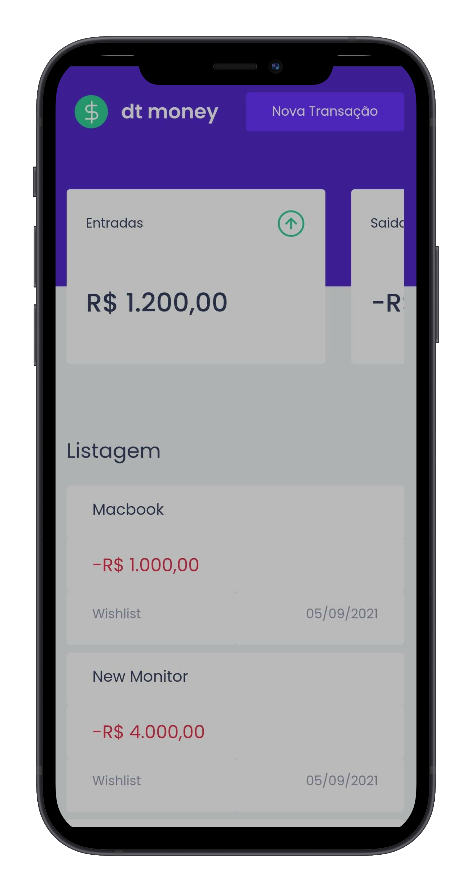

<div align="center">
  

  <h2> The application to control your finances</h2>
</div>

|  |  |
|---|---|

## 🛠 Technologies used in this application
### Frontend
- [Typescript](https://www.typescriptlang.org/)
- [React](https://reactjs.org/)
- [StyledComponents](https://styled-components.com/docs/api)
- [MirageJS](https://miragejs.com/)
- [ReactModal](https://github.com/reactjs/react-modal)
- [Polished](https://polished.js.org/)

### Backend
- [Typescript](https://www.typescriptlang.org/)
- [Node](https://nodejs.org/)
- [Docker](https://www.docker.com/)
- [ExpressJS](https://expressjs.com/)
- [PrismaORM](https://www.prisma.io/)


## 🚀 How to use?
### 📑 Pre requisites
 To initialize this project in your local machine, do you need to install the:
- [Docker](https://docs.docker.com/get-docker/)
- [Docker Compose](https://docs.docker.com/compose/)
- [Node](https://nodejs.org/)
- [Yarn](https://yarnpkg.com/)

### Starting the application
1. Clone this repository in your local machine clicking [here](https://github.com/MattFerreira18/dt.money.git) or using ``` git clone git@github.com:MattFerreira18/dt.money.git``` in your terminal.

2. Open the frontend and backend projects in your editor and in your terminal.

#### 💻 Backend
1. rename the .example.env file to .env and populate your variables.

2. install the dependencies using the ``` yarn ``` command.

3. Use ``` docker-compose up database``` in your terminal to create the database container in your local machine.

4. Use ``` yarn dev ``` to start the server.

#### 🎨 Frontend
1. install the dependencies using the ``` yarn ``` command.

2. Verify fi the backend URL is correct (present in ``` src/services/api.ts ```).

4. Use ``` yarn start ``` to start the server.

5. Use the application.

## ✍ Author
<a href="https://www.github.com/MattFerreira18">
  
  <p>Matheus Ferreira</p>
</a>

<div>
  <a href="https://www.linkedin.com/in/matheus-ferreira-9267091b3/">
    
  </a>
  <a href="https://github.com/MattFerreira18">
    
  </a>
  <a href="mailto:matheusferreira.dev@gmail.com">
    
  </a>
</div>
